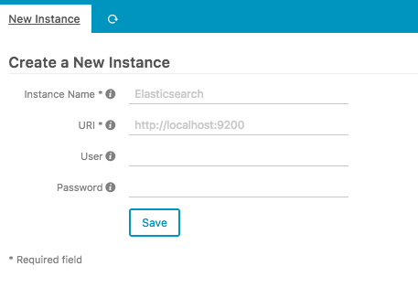
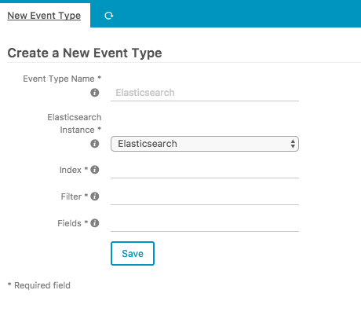

# Configuration

This chapter will give you the very basics to get the Elasticsearch module for Icinga Web 2 up and running. 

## Elasticsearch Instances

The first step to take here is to define how to connect to your Elasticsearch instances. Using the web interface is
the preferred method of configuration. Please access `Configuration -> Modules -> elasticsearch -> Instances` in order
to set up a new Elasticsearch instance.

**Name**

Name of the Elasticsearch instance.

**URI**

URI of the Elasticsearch instance.

**User** and **Password**

Credentials for authentication, if any.

## Event Types

Event types define how to access data in your Elasticsearch instances. Again, please use the web interface for
configuration and access `Configuration -> Modules -> elasticsearch -> Event Types`.

**Name**

Name of the event type.

**Instance**

Elasticsearch instance to connect to.

**Index**

Elasticsearch index pattern, e.g. `filebeat-*`.

**Filter**

Elasticsearch filter in the Icinga Web 2 URL filter format. Host macros are evaluated if you encapsulate them in curly
braces, e.g. `host={host.name}&location={_host_location}`.

**Fields**

Comma-separated list of field names to display. One or more wildcard asterisk (`*`) patterns are also accepted. Note
that the `@timestamp` field is always respected.
